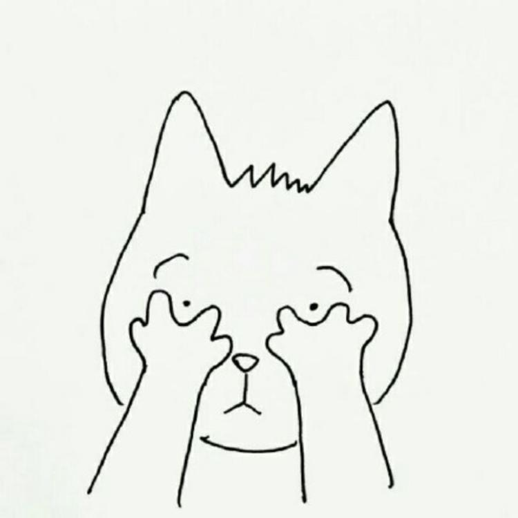

#Who am I

**My name is Long Tang and my hometown is Guangzhou, Guangdong province, China. I am a junior transfer student majoring in Comupter Sicence. I spend my first two years in Foothill College, which located in Los Altos Hill near Mountain View. This is my first year in UCSD even though I have never been to San Diego. I wish I could walk at the campus soon.**

**As a programmer, I have learnt Java, C++, Assembly Language. I am learning HTML and CSS by my own right now. A lot of things happened since I jumped into upper divison courses, and I am struggling with it. Lacking practical experience in my career and coding ability are my current shortcomings, but I am doing my best to be a better programmer.**

**There is a proverb that I really agree with:**
> he best time to plant a tree was 20 years ago. The second best time is now.

#Academic career
- [x] Foothill College
- [x] De Anza College (for a GE course)
- [ ] University of California, San Diego

#Hobbies
- Watching movies, animes, short videos in [bilibili](www.bilibili.com)
- Working out, jogging
- Hiking, traveling to national parks


##Quote Code (for Lab 1)
Some basic Unix commands:
```
chmod u+x a.sh
touch 
rm -d file
rm -r file
```

##Section Links (for Lab 1)
[Link to my personal introduction](Who am I)


